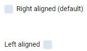

# Checkbox

### At a Glance

|Parent Class| Interfaces |
|------------|------------|
|[AbstractDwcControl](#)| <ul><li>[HasReadOnly](#)</li><li>[HasFocus](#)</li><li>[HasTabTraversal](#)</li><li>[HasTextAlignment](#)</li></ul>|

| Methods |
|------------|
| <ul><li>[`ComboBox addItem(Object key, String item)`](#)</li><li>[`HorizontalTextPosition getHorizontalTextPosition()`](#)</li><li>[`Boolean isChecked()`](#)</li><li>[`CheckBox setChecked(Boolean checked)`](#)</li><li>[`CheckBox setExpanse(CheckBox.Expanse expanse)`](#)</li><li>[`CheckBox setHorizontalTextPosition(CheckBox.HorizontalTextPosition position)`](#)</li></ul>|


| Events |
|------------|
| <ul><li>[`CheckBox onChange(Consumer<CheckBoxChangeEvent> callback)`](#)</li></ul> |

<br/>

### Checkbox Text

Check boxes can utilize the ```setText(String foo)``` method, which will positioned near the check box according to the built-in `HorizontalTextPosition` property which is detailed below. 

<br/>

### Horizontal Text Position

DWCJ checkboxes have built-in functionality to set text to be displayed either to the right or left of the box. By default, the text will be displayed to the right of the control. Show below
are the two settings: <br/>


<!-- <iframe 
loading="lazy"
src='https://hot.bbx.kitchen/webapp/controlsamples?class=control_demos.checkboxdemos.CheckboxHorizontalText' 
style={{"width": "100%"}}></iframe> -->



<br/>
Listed below are the current supported theme options for the checkbox control:<br/><br/>

|Checkbox Horizontal Text Positions|
|-|
|<ul><li>```CheckBox.HorizontalTextPosition.LEFT```</li><li>```CheckBox.HorizontalTextPosition.RIGHT```</li></ul>|

Positioning of the horizontal text is supported by use of a built-in enum class. To set the position, execute code similar to the following: <br/><br />

```java
import org.dwcj.controls.checkbox.CheckBox;

CheckBox exampleCheckBox = new CheckBox();      //Creates a new checkbox
exampleCheckBox.setText("This is demonstration text");      //Sets the text to be displayed by the checkbox
exampleCheckBox.setHorizontalTextPosition(CheckBox.HorizontalTextPosition.RIGHT);      //Sets the text' position to be to the right
```

<br/>

### Expanses
There are five checkbox expanses that are supported in the DWCJ which allow for quick styling without using CSS.
Below are the expanses supported for the checkbox control: <br/>

<!-- <iframe 
loading="lazy"
src='https://hot.bbx.kitchen/webapp/controlsamples?class=control_demos.checkboxdemos.CheckboxExpanseDemo' 
style={{"width": "100%", "height" : "100px"}}></iframe> -->


<br/>

Listed below are the current supported expanse options for the checkbox control:

|Checkbox Expanses|
|-|
|<ul><li>```CheckBox.Expanse.XSMALL```</li><li>```CheckBox.Expanse.SMALL```</li><li>```CheckBox.Expanse.MEDIUM```</li><li>```CheckBox.Expanse.LARGE```</li><li>```CheckBox.Expanse.XLARGE```</li></ul>|

<br/>Expanses are supported by use of a built-in enum class. To apply an expanse, execute code similar to the following: <br/><br />

```java
import org.dwcj.controls.checkbox.CheckBox;

CheckBox exampleCheckBox = new CheckBox();      //Creates a new checkbox
exampleCheckBox.setText("This is demonstration text");      //Sets the text to be displayed by the checkbox
exampleCheckBox.setExpanse(CheckBox.Expanse.MEDIUM);     //Sets the checkbox's expanse to the medium size.
```

<!-- 

### Sample Program

The sample program below is a simple demonstration that will display a message box 
each time a checkbox is checked on or off.

<iframe
loading="lazy" 
src='https://hot.bbx.kitchen/webapp/controlsamples?class=control_demos.checkboxdemos.CheckboxDemo' 
style={{"width": "300px","height" : "200px"}}></iframe>

<details>
    <summary>Show Code</summary>


```java
    import org.dwcj.App;
    import org.dwcj.controls.panels.AppPanel;
    import org.dwcj.controls.checkbox.CheckBox;
    import org.dwcj.controls.checkbox.events.CheckBoxChangeEvent;
    import org.dwcj.exceptions.DwcAppInitializeException;


    public class CheckboxDemo extends App{

        @Override
        public void run() throws DwcAppInitializeException {


            AppPanel panel = new AppPanel();
            panel.setStyle("display", "inline-grid");
            panel.setStyle("grid-template-columns", "1fr");
            panel.setStyle("padding", "10px");
            panel.setStyle("gap", "50px");

            CheckBox cb1 = new CheckBox();
            cb1.setText("Checkbox 1").onChange(this::checkboxDisplay);
            CheckBox cb2 = new CheckBox();
            cb2.setText("Checkbox 2").onChange(this::checkboxDisplay);
            CheckBox cb3 = new CheckBox();
            cb3.setText("Checkbox 3").onChange(this::checkboxDisplay);

            panel.add(cb1, cb2, cb3);

        }

        void checkboxDisplay(CheckBoxChangeEvent ev){
            String name = ev.getControl().getText();
            String isChecked = ev.getControl().isChecked() ? "on" : "off";
            App.msgbox(name + " has been checked " + isChecked);
        }

    }

```

</details> 

-->
