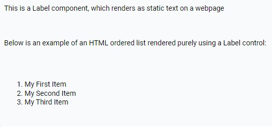
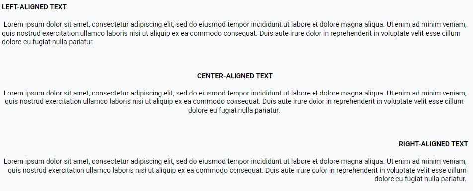

# Label

### At a Glance

|Parent Class| Interfaces |
|------------|------------|
|[AbstractDwcControl](#)| <li>[HasTextAlignment](#)</li>|

| Methods |
|------------|
| [`Label(String text)`](#)|

<br />

### Label Text

The label's text can be set either at creation using the parameterized constructor, or by utilizing the inherited `setText()` method. 

In addition to using the label as static text, it can also be used as an HTML tag within your code. Simply set the label's text to the desired HTML tag with the various attributes, class names, etc, and
the label will be replaced with the desired HTML element.

<!-- <iframe 
loading="lazy"
src='https://hot.bbx.kitchen/webapp/controlsamples?class=control_demos.labeldemos.LabelDemo' 
style={{"width": "100%", "height":"250px"}}></iframe> -->



<br/>

To achieve the above results, execute code similar to the following:

```java
Label l1 = new Label("This is a Label component, which renders as static text on a webpage");
Label l2 = new Label("Below is an example of an HTML ordered list rendered purely using a Label control: ");
Label l3 = new Label("<html><ol><li>My First Item</li><li>My Second Item</li><li>My Third Item</li></ol><html>");
```

<br />

### Text Alignment

Label text can also be aligned using the inherited alignment functionality provided with the [TextAlignable](#) interface.

<!-- <iframe 
loading="lazy"
src='https://hot.bbx.kitchen/webapp/controlsamples?class=control_demos.labeldemos.LabelAlignment' 
style={{"width": "100%", "height":"400px"}}></iframe> -->



<br/>