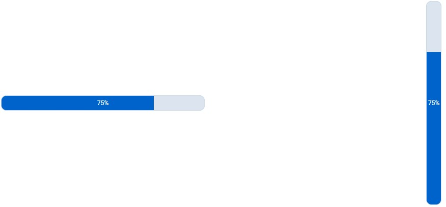
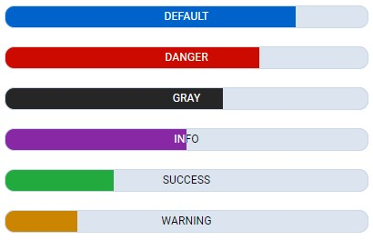

# Progress Bar

### At a Glance

|Parent Class|
|------------|
|[AbstractDwcControl](#)|

| Methods |
|------------|
| <ul><li>[`Integer getMaximum()`](#)</li><li>[`Integer getMinimum()`](#)</li><li>[`Integer getOrientation()`](#)</li><li>[`String getText()`](#)</li><li>[`Integer getValue()`](#)</li><li>[`Boolean isIndeterminate()`](#)</li><li>[`Boolean isStringPainted()`](#)</li><li>[`ProgressBar setIndeterminate(Boolean indeterminate)`](#)</li><li>[`ProgressBar setMaximum(Integer maximum)`](#)</li><li>[`ProgressBar setMinimum(Integer minimum)`](#)</li><li>[`ProgressBar setOrientation(Integer orientation)`](#)</li><li>[`ProgressBar setStringPainted(Boolean stringPainted)`](#)</li><li>[`ProgressBar setProgressBarText(String text)`](#)</li><li>[`ProgressBar setValue(Integer value)`](#)</li></ul>|

<br/>

### Text and String Painting

By default when created, the progress bar will display the percentage complete in the format "XX%". Using the `setText()` method, you can use the placeholder {{x}} to get the current value as a percentage. Additionally, you can use the placeholder {{value}} to get the raw current value.

<br/>

### Orientation

The DWCJ's progress bar allows the developer to chose the direction in which the bar will fill as progress is made. The options are either filling vertically from bottom to top, or horizontally from left to right. Setting the orientation <b> does not </b> automatically set the dimensions for the bar, this must be done by the developer. 

<!-- <iframe 
loading="lazy"
src='https://hot.bbx.kitchen/webapp/controlsamples?class=control_demos.progressbardemos.ProgressbarOrientation' 
style={{"width": "100%", "height":"425px"}}></iframe> -->

<br/>



<details>
    <summary>Show Code</summary>

```java
import org.dwcj.controls.progressbar.ProgressBar;

ProgressBar barHorizontal = new Progressbar();
ProgressBar barVertical = new Progressbar();

//NOTE: Styling will be included to make the choices more overtly obvious

barHorizontal.setStyle("width", "400px");
barHorizontal.setStyle("height", "30px");
barHorizontal.setValue(75);
barHorizontal.setMaximum(100);

barVertical.setOrientation("orientation", "vertical");
barVertical.setStyle("height", "400px");
barVertical.setStyle("width", "30px");
barVertical.setValue(75);
barVertical.setMaximum(100);
```

</details>


<br/>

### Indeterminate

The progress bar in the DWCJ allows for indeterminate display, displaying an animation that conveys continuous progress that is not quantified. 

<!-- <iframe 
loading="lazy"
src='https://hot.bbx.kitchen/webapp/controlsamples?class=control_demos.progressbardemos.ProgressbarIndeterminate' 
style={{"width": "100%", "height":"100px"}}></iframe><br/><br /> -->


```java
import org.dwcj.controls.progressbar.ProgressBar;

ProgressBar exampleBar = new ProgresBar();
exampleBar.setIndeterminate(true)
```

<br/>

### Upper and Lower Limit

The progress bar can has minimum and maximum values that can be set, which will alter how the progress

<!-- <iframe 
loading="lazy"
src='https://hot.bbx.kitchen/webapp/controlsamples?class=control_demos.progressbardemos.ProgressbarMinMax' 
style={{"width": "100%", "height":"100px"}}></iframe> -->


<br />


### Themes

The DWCJ progress bar comes with 6 themes built in for quick styling without the use of CSS.
Shown below are progress bars with each of the supported Themes applied: <br/>

<!-- <iframe 
loading="lazy"
src='https://hot.bbx.kitchen/webapp/controlsamples?class=control_demos.progressbardemos.ProgressbarThemes' 
style={{"width": "100%", "height":"320px"}}></iframe> -->


<br/>

|Progress Bar Themes|
|-|
|<ul><li>```ProgressBar.Theme.DEFAULT```</li><li>```ProgressBar.Theme.DANGER```</li><li>```ProgressBar.Theme.GRAY```</li><li>```ProgressBar.Theme.INFO```</li><li>```ProgressBar.Theme.SUCCESS```</li><li>```ProgressBar.Theme.WARNING```</li></ul>|

<br/>Theming is supported by use of a built-in enum class. To apply a theme, execute code similar to the following: <br/><br />

```java
import org.dwcj.controls.progressbar.ProgressBar;

ProgressBar exampleBar = new ProgressBar();      //Creates a new progress bar"
exampleBar.setTheme(ProgressBar.Theme.DEFAULT);      //Sets the bar's theme to be the default theme.
```