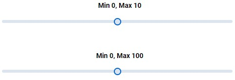
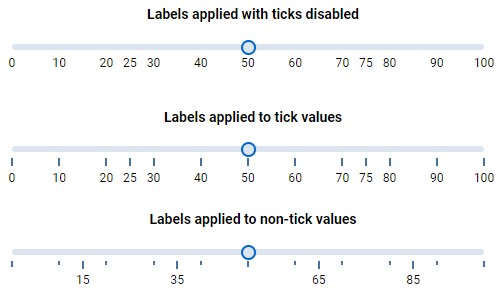
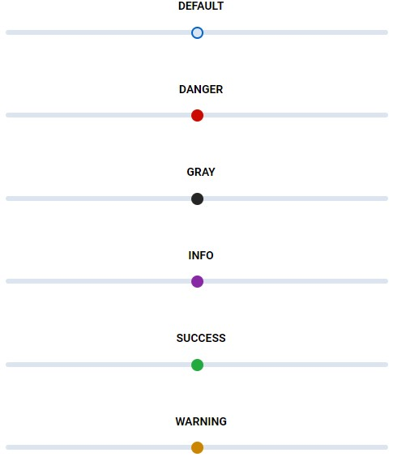

# Slider

### At a Glance

|Parent Class| Interfaces |
|------------|------------|
|[AbstractDwcControl](#)| <ul><li>[HasMouseWheelCondition](#)</li><li>[HasFocus](#)</li><li>[HasTabTraversal](#)</li></ul>|

| Methods |
|------------|
| <ul><li>[`Map<Integer,String> getLabels()`](#)</li><li>[`Integer getMajorTickSpacing()`](#)</li><li>[`Integer getMaximum()`](#)</li><li>[`Integer getMinimum()`](#)</li><li>[`Integer getMinorTickSpacing()`](#)</li><li>[`Integer getOrientation()`](#)</li><li>[`Integer getValue()`](#)</li><li>[`Boolean isInverted()`](#)</li><li>[`Boolean isPaintLabels()`](#)</li><li>[`Boolean isPaintTicks()`](#)</li><li>[`Boolean isSnapToTicks()`](#)</li><li>[`Slider setInverted(Boolean inverted)`](#)</li><li>[`Slider setLabels(Map<Integer,String> labels)`](#)</li><li>[`Slider setMajorTickSpacing(Integer tick)`](#)</li><li>[`Slider setMaximum(Integer maximum)`](#)</li><li>[`Slider setMinimum(Integer minimum)`](#)</li><li>[`Slider setMinorTickSpacing(Integer tick)`](#)</li><li>[`Slider setOrientation(Orientation orientation)`](#)</li><li>[`Slider setPaintLabels(Boolean paint)`](#)</li><li>[`Slider setPaintTicks(Boolean paint)`](#)</li><li>[`Slider setSnapToTicks(Boolean snap)`](#)</li><li>[`Slider setValue(Integer value)`](#)</li></ul>|


| Events |
|------------|
| <ul><li>[`Slider onScroll(Consumer<SliderOnControlScrollEvent> callback)`](#)</li></ul> |

<br/>

### Upper and Lower Limit

Use the `setMinimum()` and `setMaximum()` methods to determine the upper and lower bound of the slider. Each interval on the slider has a distance of 1, meaning that a slider with maximum 10 and minimum of 0 will have 10 intervals on the slider, whereas a maximum of 100 and minimum of 0 will have 100 intervals. These intervals will evenly distribute on the slider, depending on the height and width dimensions that it has been given by the developer. 

<!-- <iframe 
loading="lazy"
src='https://hot.bbx.kitchen/webapp/controlsamples?class=control_demos.sliderdemos.SliderMaxMinDemo' 
style={{"width": "100%", "height":"225px"}}></iframe> -->



<br />

### Ticks and Labeling

Slider controls can be customized to show ticks, or spaces bounded by lines to represent distances. Major ticks will be larger and more noticeable than minor ticks, and both can be configured to appear at the desired intervals. It is also possible to set the slider to snap to the tick values using the `setSnapToTicks()` method.

<iframe 
loading="lazy"
src='https://hot.bbx.kitchen/webapp/controlsamples?class=control_demos.sliderdemos.SliderTickDemo' 
style={{"width": "100%", "height":"250px"}}></iframe>


<br />

It is also possible to set labels on a slider. These labs may or may not correspond with ticks that have been set. To set the labels, simply create a map with key value pairs, where the keys are the integer values to be labeled, and the values are the desired label string. 
<b>NOTE:</b> If tick snapping is enabled, the slider will only snap to ticked spaces specifically. If a non-ticked value has a label, it will not be snapped to by the slider.
<br />
<br />

<!-- <iframe 
loading="lazy"
src='https://hot.bbx.kitchen/webapp/controlsamples?class=control_demos.sliderdemos.SliderLabelDemo' 
style={{"width": "100%", "height":"350px"}}></iframe> -->



<br />


### Orientation and Inversion

Sliders can be oriented either horizontally or vertically by using the `setOrientation()` method.
<!-- 
<iframe 
loading="lazy"
src='https://hot.bbx.kitchen/webapp/controlsamples?class=control_demos.sliderdemos.SliderOrientationDemo' 
style={{"width": "100%", "height":"400px"}}></iframe> -->


<br />

It is also possible to invert a slider. By default, the minimum value of a vertical slider is at the bottom and the maximum value is at the top. For a horizontal slider, the minimum value is to the left and the maximum value is to the right. The orientation reverses for inverted sliders.
<!-- 
<iframe 
loading="lazy"
src='https://hot.bbx.kitchen/webapp/controlsamples?class=control_demos.sliderdemos.SliderInversionDemo' 
style={{"width": "100%", "height":"200px"}}></iframe> -->


<br />

### Themes

The slider control comes with 6 themes built in for quick styling without the use of CSS.
Shown below are sliders with each of the supported Themes applied: <br/>

<!-- <iframe 
loading="lazy"
src='https://hot.bbx.kitchen/webapp/controlsamples?class=control_demos.sliderdemos.SliderThemesDemo' 
style={{"width": "100%", "height":"620px"}}></iframe> -->



<br/>

|Slider Themes|
|-|
|<ul><li>```Slider.Theme.DEFAULT```</li><li>```Slider.Theme.DANGER```</li><li>```Slider.Theme.GRAY```</li><li>```Slider.Theme.INFO```</li><li>```Slider.Theme.SUCCESS```</li><li>```Slider.Theme.WARNING```</li></ul>|

<br/>Theming is supported by use of a built-in enum class. To apply a theme, execute code similar to the following: <br/><br />

```java
import org.dwcj.controls.slider.Slider;

Slider exampleBar = new Slider();      //Creates a new slider"
exampleBar.setTheme(Slider.Theme.DEFAULT);      //Sets the slider's theme to be the default theme.
```