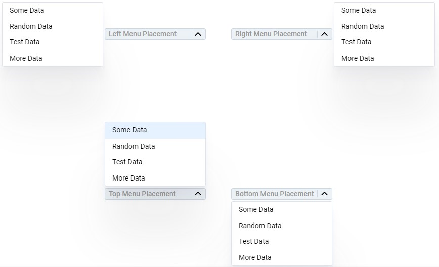

# Text Combo Box

### Menu Placement

The text combo box can be configured to open the menu in various positions relative to the position of the control itself.

<!-- <iframe 
loading="lazy"
src='https://hot.bbx.kitchen/webapp/controlsamples?class=control_demos.textcomboboxdemos.TextComboBoxPlacement' 
style={{"width": "100%", "height":"350px"}}></iframe> -->



<br/>

```java
import org.dwcj.controls.textcombobox.TextComboBox;

TextComboBox exampleTextComboBox = new TextComboBox();      //Creates a new TextComboBox
exampleTextComboBox.setAttribute("placement", "left");  
```

<br/>

### Label

The text combo box control can be easily labeled without the needing to create an extra label control using the `setAttribute()` method and passing the desired label as a string, as shown below: <br/>

<!-- <iframe 
loading="lazy"
src='https://hot.bbx.kitchen/webapp/controlsamples?class=control_demos.textcomboboxdemos.TextComboBoxLabel' 
style={{"width": "100%", "height":"200px"}}></iframe> -->


<br/>

```java
import org.dwcj.controls.textcombobox.TextComboBox;

TextComboBox exampleTextComboBox = new TextComboBox();      //Creates a new TextComboBox
exampleTextComboBox.setAttribute("label", "Example Label");     
```

<br/>

### Placeholder

It is also possible to set placeholder text within the control to better help users understand what type of input is expected. Similar to a label, this can be accomplished using the `setAttribute()` method: <br/>

<!-- <iframe 
loading="lazy"
src='https://hot.bbx.kitchen/webapp/controlsamples?class=control_demos.textcomboboxdemos.TextComboBoxPlaceholder' 
style={{"width": "100%", "height":"200px"}}></iframe> -->


<br/>

```java
import org.dwcj.controls.textcombobox.TextComboBox;

TextComboBox exampleTextComboBox = new TextComboBox();      //Creates a new TextComboBox
exampleTextComboBox.setAttribute("placeholder", "Example Placeholder");  
```

<br/>

### Expanses

DWCJ's text combo box comes with 5 expanses for quick styling without the use of CSS.
Below are the various expanses supported for the text box control: <br/>

<!-- <iframe 
loading="lazy"
src='https://hot.bbx.kitchen/webapp/controlsamples?class=control_demos.textcomboboxdemos.TextComboBoxExpanses' 
style={{"width": "100%", "height":"400px"}}></iframe> -->


<br/>

|Text Box Expanses|
|-|
|<ul><li>```TextBomboBox.Expanse.XSMALL```</li><li>```TextBomboBox.Expanse.SMALL```</li><li>```TextBomboBox.Expanse.MEDIUM```</li><li>```TextBomboBox.Expanse.LARGE```</li><li>```TextBomboBox.Expanse.XLARGE```</li></ul>|

<br/>Expanses are supported by use of a built-in enum class. To apply an expanse, execute code similar to the following: <br/><br />

```java
import org.dwcj.controls.textcombobox.TextComboBox;

TextComboBox exampleTextComboBox = new TextComboBox();      //Creates a new Text Box
exampleTextComboBox.setExpanse(TextComboBox.Expanse.MEDIUM);    
```