# Users

This section of the documentation will cover the steps required only for 
users who wish to use the DWCJ for web and/or application development.
This installation will not allow users to contribute to the DWCJ implementation
code itself.
 

**NOTE:** This walkthrough will cover installation on a Windows system - installation
steps may vary for Mac/Linux OS devices.
 

Installation will be broken down into the following steps:

1. Java and Maven download and configuration
2. BBj download and installation
3. Using the BBj Plugin Manager to create your application
4. Launching your application

## 1) Java and Maven Download and Configuration
This section describes the installation process for Java and Maven, both of which
will be required for development of applications and the engine itself. If you already
have Java and Maven downloaded, please skip to [**Step 2**](#section2). If you also have BBj installed on your system, please skip to [**Step 3**](#section3).

### Download Java for OS:
Begin by installing Java on your computer. You’ll want to select the version that matches your OS. 
A list of versions can be found [by following this link](https://adoptium.net/temurin/releases/).

### Configure the Java Installation
After selecting the correct version, follow the installation instructions. Note that you’ll want to 
set the JAVA_HOME variable. On Windows, this can be done by selecting the “Will be installed on local hard drive” 
option for the “Set JAVA_HOME variable” option during installation.

With this step completed, Java will be installed on your system.

 

### Install Maven

Next we’ll install Maven in order to allow the creation of a .jar file from the changes made to the engine. 
Make sure you take note of the location in which you install Maven, as this path will be needed in the next step. 
Go to [this link and select the correct download for your OS](https://maven.apache.org/download.cgi).

 

### Configure Environment Variables for Maven

After Maven has been installed, various environment variables will need to be set to ensure Maven is used 
properly. This guide will walk through how to do this in Windows. Start by searching “Environment” from 
the start menu and select **“Edit the system environment variables”**

Once the System Properties window appears, select the **“Environment Variables”** button from the bottom right:

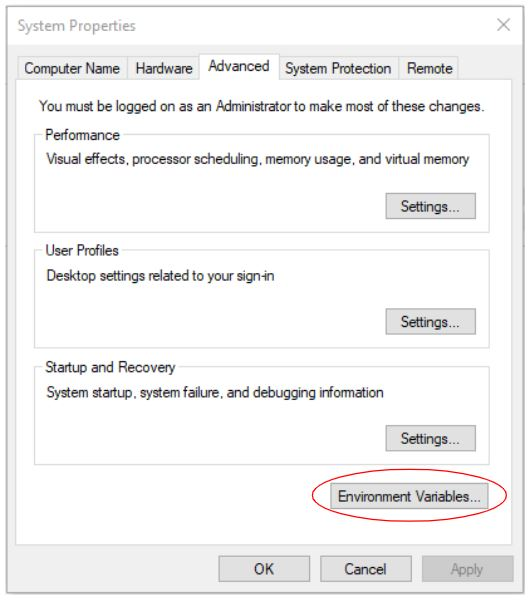

This window will allow us to create two new user variables, and to edit the path system variable. Select the **“New”** button
in the top portion of the window. 

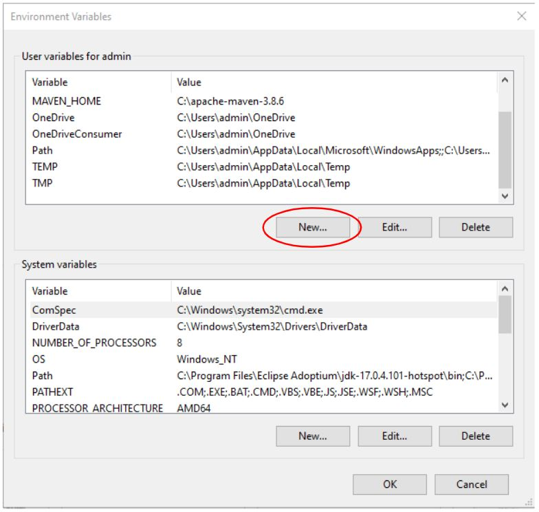

A window will pop up with two fields, one for a variable name, and one for a variable value. 
For the name, enter **“MAVEN_HOME”**, and for the value, enter the path you installed your Maven files at. 
An example path might be **“C:\apache-maven-3.8.6”**. Hit okay to confirm.

To finish configuring environment variables, click on the **“Path”** entry in the **“System Variables"** section. 
Then, select the **“Edit”** option. This will bring up a dialog window with the various Paths your system will check.

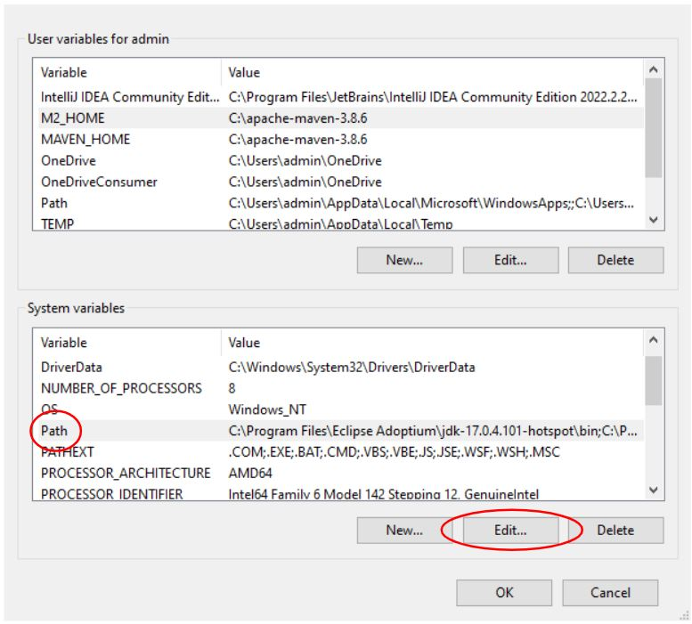

This will open a dialog window which will allow you to add a path to the list. Select **“New”**, and add the path to your 
Maven binary (this should be in the folder you downloaded from the Maven website).

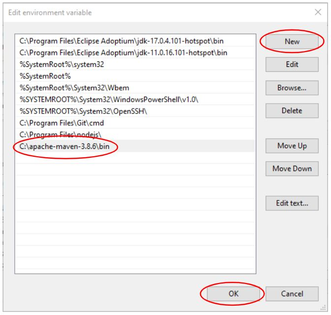

To confirm both of these steps have been completed, open your preferred command line tool, and enter the following command:
**java -–version && mvn–version**

This should display the versions of both Java and Maven installed on your computer if the above steps were successfully completed:

 
 
 

## 2) BBj Download and Installation

The following video describes the steps needed download the tool that will install BBj on your machine. Watch from the beginning until the **1:30** mark. 

<iframe width="560" height="315" src="https://www.youtube.com/embed/Ovk8kznQfGs?end=90" title="YouTube video player" frameborder="0" allow="accelerometer; autoplay; clipboard-write; encrypted-media; gyroscope; picture-in-picture" allowfullscreen="allowfullscreen"></iframe>

Once you've downloaded the installer, follow this video's instructions to walk you through the installer options to put BBj on your machine. Follow this 
video from **4:13** to **8:23**.

<iframe width="560" height="315" src="https://www.youtube.com/embed/Ovk8kznQfGs?start=253&end=503" title="YouTube video player" frameborder="0" allow="accelerometer; autoplay; clipboard-write; encrypted-media; gyroscope; picture-in-picture" allowfullscreen="allowfullscreen"></iframe>

 
 
 

## 3) Using the BBj Plugin Manager

Once BBj has been installed, we can use the BBj Plugin Manager to give us
access to the DWCJ and start development on our project.

### Launch the BBj Plugin Manager

Begin by navigating to the bbx folder you installed in the previous step. An 
example path would be **C:\bbx\plugins**. 

 

From here, navigate to and open the plugins folder.

 

In this folder, you should see a .bbj file named **"PluginManagerLauncher.bbj"**.
In order to launch this application, we'll need to tell the system which program
to launch it with. 

 

Double click on the file, at which point you'll be prompted to choose a program
to open the file. Select **"More apps**

 

Then select **Look for another app on this PC**, at which point we can navigate
to the correct folder and select BBj, which will allow us to run the 
Plugin Manager

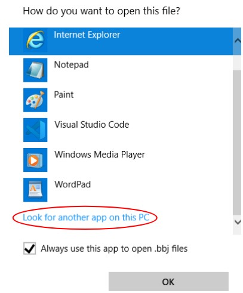
 

Navigate to the bbx folder you created during BBj installation, and open the
bin folder, where you should find the BBj application. A sample path will 
look something like **"C:/bbx/bin"**. Select the BBj application, which
will open the Plugin Manager.

 

Once this is complete, you should see the Plugin Manager window open. It 
should look something like the screenshot below:

 

### Create a DWCJ application deployment

From this window, first click the **"Available Plugins** tab near the 
top left corner of the window. This will open a menu with many more available
plugins. Check the **"Show versions under development"** checkbox in order to
show the DWCJ entry.

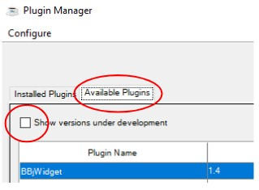
 

Scroll down through the various selections until you find the DWCJ entry in
the list. Select this entry, and then click the **"Install"** button at the
bottom right of the Plugin Manager window.

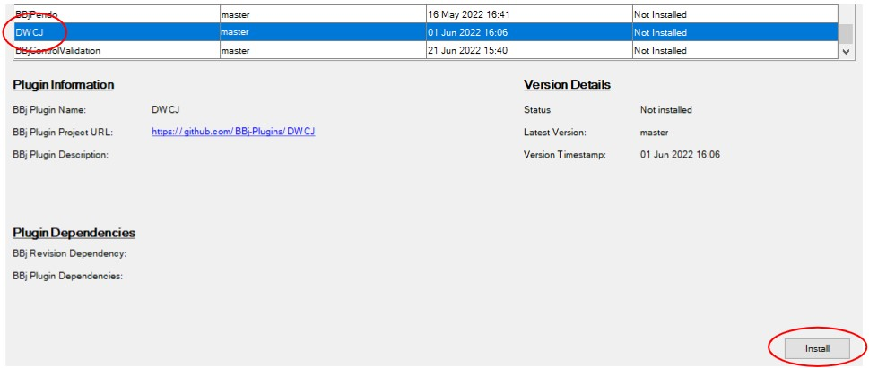
 

After the DWCJ plugin has been installed, click on the **"Installed Plugins"**
tab once again, which should now display the DWCJ among the list of other 
installed plugins. Select the DWCJ from the list, and click **"Configure"**
towards the top right of the window.

 

This will open the configuration window. Here, we'll create a new configuration
to begin an instance of the DWCJ. Select the **"+"** button below the 
**"Configurations"** field as shown in the screenshot below

 

Give your configuration a name, and then click the **"New Project"** button
under the **"DWCJ Projects"** window.

 

This will open a window which will allow the selection of a project template.
Select **"HelloWorldJava"** from the template list. This will create a small file with
a simple program that can be run once configuration is complete.
You'll also be prompted to select the location of the project. This walkthrough will use 
a new folder,though this isn't overtly necessary. We'll name the new folder **"dwcj_app"**.

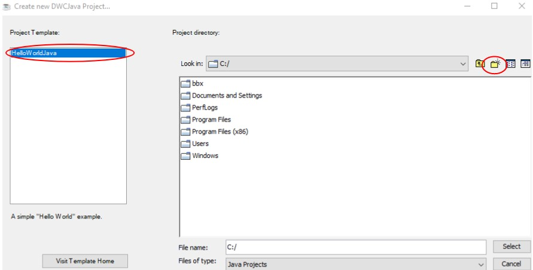
 

Once this folder is created, click on the new folder (or the existing folder
you've chosen to create your project inside of), and then click the select
button at the bottom right of the window.

 

You should now see your configuration listed on the left side of the window,
with two file paths listed under the DWCJ Projects window. It should look
similar to the screenshot below.

 

## 4) Opening Your Project in an IDE

Now that the files we need have been created, the project can be opened in 
an editor or IDE. This tutorial will use Microsoft’s VS Code as the development IDE. 
Other IDEs may be used, and may come with other features or functionality. **VS Code can be [downloaded free of charge from this link.](https://code.visualstudio.com/Download)**

### Navigating to your files in your IDE

Click on **"File"** at the top left of the VS Code window, and select the
**"Open Folder..."** menu option. This will open an explorer window.

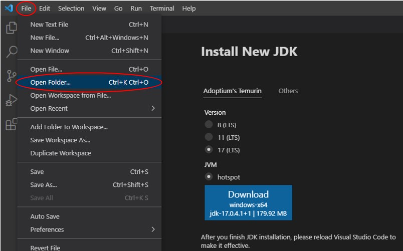
 

Select the folder where the DWCJ files were initialized in the previous step.
An example path would be **"C:/dwcj_app/"**. Once you've navigated to the
correct folder, click on the **"Select Folder"** button.

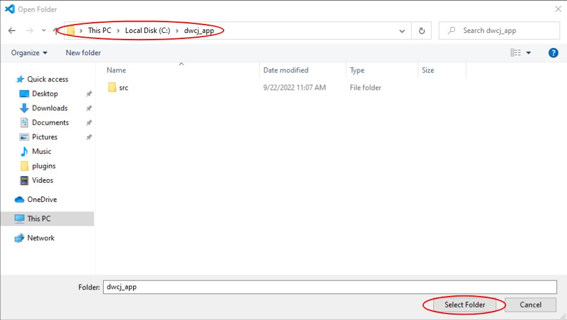
 

## 5) Launching Your DWCJ "Hello World" Application

Navigate back to the Plugin Manager, and select the DWCJ from the installed
plugins list, and click **"Configure"**. 

 

After opening the configuration menu, you can launch your application! Click on
the **Launch** button.

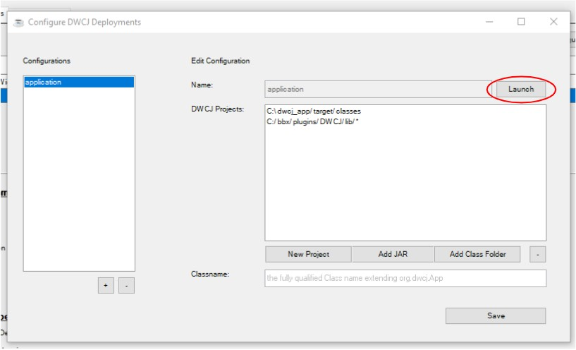
 

If configured correctly, a welcome window should appear, and you should be able
to launch your sample application!

**Congratulations!** You're not ready for development in the DWCJ!